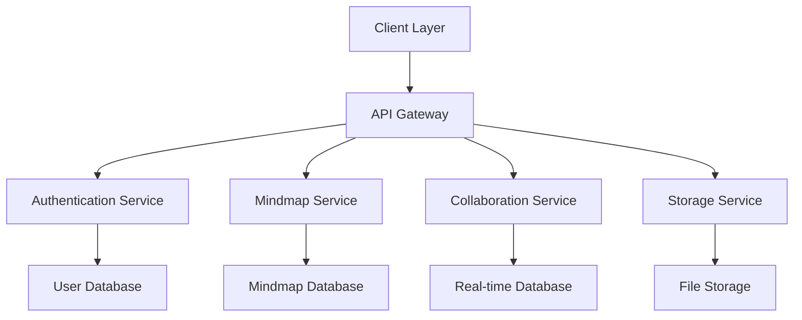

# Core Strategy

## Overview

The Core Strategy document outlines the fundamental principles, architecture decisions, and technical direction for the Mindscape platform. It serves as the foundation for all other strategy documents and implementation decisions.

## Vision and Goals

### Project Vision
Mindscape is a collaborative mind mapping platform that enables users to create, share, and collaborate on visual knowledge maps. The platform combines intuitive design with powerful features to support both individual and team-based knowledge management.

### Core Objectives
1. **User Experience**
   - Intuitive interface for mind map creation and editing
   - Real-time collaboration capabilities
   - Cross-platform accessibility
   - Responsive design for all devices

2. **Technical Excellence**
   - Scalable architecture
   - High performance
   - Secure data handling
   - Reliable infrastructure

3. **Business Goals**
   - Sustainable growth
   - User engagement
   - Data privacy
   - Platform extensibility

## System Architecture

### High-Level Architecture

### Core Components
1. **Frontend**
   - React-based web application
   - Progressive Web App capabilities
   - Offline support
   - Real-time updates

2. **Backend Services**
   - RESTful API Gateway
   - Microservices architecture
   - Event-driven communication
   - Caching layer

3. **Data Layer**
   - PostgreSQL for relational data
   - MongoDB for document storage
   - Redis for caching
   - S3 for file storage

4. **Infrastructure**
   - Kubernetes orchestration
   - AWS cloud services
   - CI/CD pipeline
   - Monitoring and logging

## Technology Stack

### Frontend Technologies
- **Framework**: React 18+
- **State Management**: Redux Toolkit
- **Styling**: Tailwind CSS
- **Testing**: Jest, React Testing Library
- **Build Tools**: Vite, Webpack

### Backend Technologies
- **Language**: Python 3.11+
- **Framework**: FastAPI
- **Database**: PostgreSQL 15, MongoDB 6
- **Cache**: Redis 7
- **Message Queue**: RabbitMQ

### Infrastructure
- **Containerization**: Docker
- **Orchestration**: Kubernetes
- **Cloud Provider**: AWS
- **CI/CD**: GitHub Actions
- **Monitoring**: Prometheus, Grafana

## Design Patterns

### Microservices Architecture
- Service independence
- API-first design
- Event-driven communication
- Circuit breaker pattern
- Bulkhead pattern

### Data Patterns
- CQRS for complex queries
- Event sourcing for audit trails
- Caching strategies
- Data sharding
- Read replicas

### Security Patterns
- Zero-trust architecture
- JWT authentication
- Role-based access control
- Encryption at rest and in transit
- Secure secret management

## Integration Patterns

### API Design
- RESTful principles
- OpenAPI specification
- Versioning strategy
- Rate limiting
- Error handling

### Event System
- Pub/Sub architecture
- Event sourcing
- Message queues
- WebSocket connections
- Real-time updates

### Third-Party Integration
- OAuth 2.0
- Webhook support
- API key management
- Rate limiting
- Error handling

## Technical Documentation

- [Development Guide](../technical/development/DEVELOPMENT_GUIDE)
- [API Specification](../technical/api/API_SPECIFICATION)
- [Database Schema](../technical/database/DATABASE_SCHEMA)
- [Infrastructure Overview](../technical/infrastructure/INFRASTRUCTURE_OVERVIEW)

## Related Documents

- [Development and Agile Strategy](DEVELOPMENT_AND_AGILE_STRATEGY)
- [Quality Strategy](QUALITY_STRATEGY)
- [Security and Data Strategy](SECURITY_AND_DATA_STRATEGY)
- [Infrastructure Strategy](INFRASTRUCTURE_STRATEGY)
- [Documentation Strategy](DOCUMENTATION_STRATEGY)
- [Team and Process Strategy](TEAM_AND_PROCESS_STRATEGY)
- [Integration and Monitoring Strategy](INTEGRATION_AND_MONITORING_STRATEGY) 