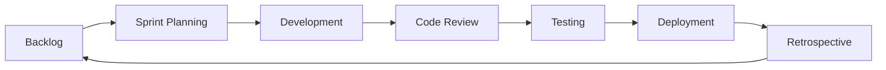

# Development and Agile Strategy

## Overview

The Development and Agile Strategy document outlines our approach to software development, project management, and team collaboration. It combines development practices with agile methodologies to ensure efficient and high-quality delivery of the Mindscape platform.

## Development Methodology

### Agile Principles
- Iterative development
- Continuous delivery
- Collaborative planning
- Adaptive to change
- Regular feedback loops

### Development Workflow


## Development Process

### Code Management
```yaml
git_workflow:
  branches:
    main: production
    develop: staging
    feature/*: feature branches
    hotfix/*: emergency fixes
  rules:
    - squash commits
    - rebase before merge
    - code review required
    - CI must pass
```

### Development Environment
```yaml
development_setup:
  tools:
    - docker
    - vscode
    - git
    - node
    - python
  requirements:
    - local database
    - redis cache
    - message queue
    - file storage
```

### CI/CD Pipeline
```yaml
# GitHub Actions workflow
name: CI/CD
on: [push, pull_request]
jobs:
  build:
    runs-on: ubuntu-latest
    steps:
      - uses: actions/checkout@v3
      - name: Install Dependencies
        run: npm install
      - name: Run Tests
        run: npm test
      - name: Build
        run: npm run build
      - name: Deploy
        if: github.ref == 'refs/heads/main'
        run: npm run deploy
```

## Agile Practices

### Sprint Management
```yaml
sprint_configuration:
  duration: 2 weeks
  planning:
    - story point estimation
    - capacity planning
    - task breakdown
  ceremonies:
    - daily standup
    - sprint planning
    - sprint review
    - retrospective
```

### Story Management
```yaml
user_stories:
  format: "As a [user], I want [feature] so that [benefit]"
  acceptance_criteria:
    - testable
    - measurable
    - specific
  definition_of_done:
    - code reviewed
    - tests passing
    - documentation updated
    - deployed to staging
```

### Team Collaboration
```yaml
collaboration_tools:
  communication:
    - slack
    - zoom
  project_management:
    - jira
    - confluence
  code_review:
    - github
    - sonarqube
  documentation:
    - docusaurus
    - swagger
```

## Quality Assurance

### Code Standards
```python
# Python code style
def example_function(param1: str, param2: int) -> bool:
    """
    Example function with type hints and docstring.
    
    Args:
        param1: Description of first parameter
        param2: Description of second parameter
        
    Returns:
        Description of return value
    """
    return True
```

### Review Process
```yaml
code_review:
  checklist:
    - code style
    - test coverage
    - documentation
    - performance
    - security
  approval:
    - minimum 1 reviewer
    - no blocking comments
    - all tests passing
```

## Technical Documentation

- [Development Guide](../technical/development/DEVELOPMENT_GUIDE)
- [API Specification](../technical/api/API_SPECIFICATION)
- [Agile Strategy](AGILE_STRATEGY)
- [Onboarding Strategy](ONBOARDING_STRATEGY)
- [Deployment Strategy](DEPLOYMENT_STRATEGY)

## Related Documents

- [Core Strategy](CORE_STRATEGY)
- [Quality Strategy](QUALITY_STRATEGY)
- [Infrastructure Strategy](INFRASTRUCTURE_STRATEGY)
- [Documentation Strategy](DOCUMENTATION_STRATEGY) 