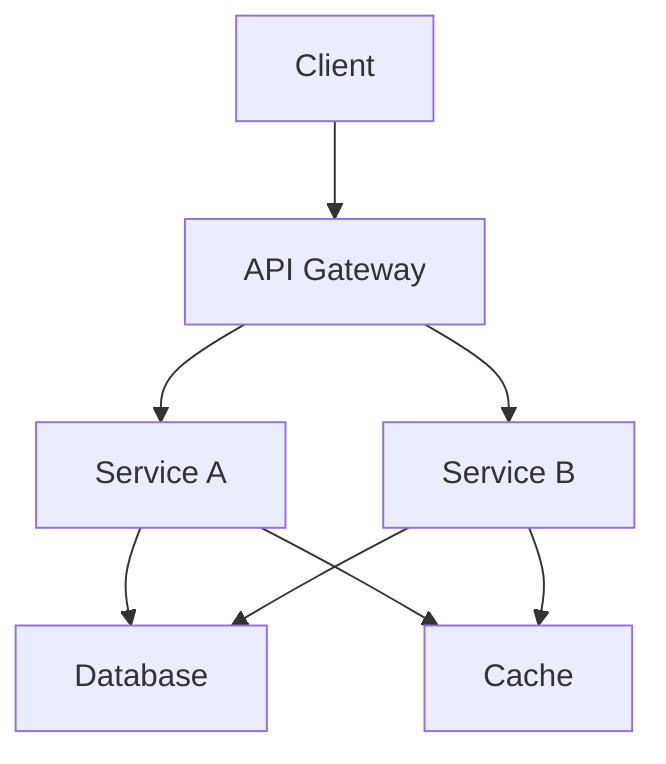

# Integration and Monitoring Strategy

## Overview

The Integration and Monitoring Strategy document defines our approach to system integration, service monitoring, and observability. It combines integration patterns with monitoring solutions to ensure system reliability and performance.

## Integration Patterns

### API Integration
```yaml
api_integration:
  patterns:
    - rest
    - graphql
    - websocket
    - grpc
  standards:
    - openapi
    - json schema
    - protobuf
    - asyncapi
```

### Service Integration


## Monitoring Architecture

### Metrics Collection
```yaml
metrics:
  system:
    - cpu usage
    - memory usage
    - disk i/o
    - network traffic
  application:
    - request rate
    - error rate
    - response time
    - queue length
  business:
    - active users
    - conversion rate
    - feature usage
    - revenue metrics
```

### Alerting Rules
```yaml
alerts:
  critical:
    - error_rate > 5%
    - response_time_p95 > 1000ms
    - cpu_usage > 90%
    - memory_usage > 95%
  warning:
    - error_rate > 1%
    - response_time_p95 > 500ms
    - cpu_usage > 80%
    - memory_usage > 85%
```

## Integration Implementation

### API Gateway Configuration
```yaml
api_gateway:
  routes:
    - path: /api/v1/users
      service: user-service
      methods: [GET, POST, PUT, DELETE]
    - path: /api/v1/mindmaps
      service: mindmap-service
      methods: [GET, POST, PUT, DELETE]
  policies:
    - rate limiting
    - authentication
    - caching
    - circuit breaking
```

### Service Mesh
```yaml
service_mesh:
  components:
    - envoy proxy
    - istio control plane
    - prometheus
    - grafana
  features:
    - service discovery
    - load balancing
    - traffic management
    - security
```

## Monitoring Implementation

### Logging Configuration
```python
# Logging setup
import logging
import structlog

logging.basicConfig(
    level=logging.INFO,
    format='%(asctime)s - %(name)s - %(levelname)s - %(message)s'
)

structlog.configure(
    processors=[
        structlog.processors.TimeStamper(fmt="iso"),
        structlog.processors.JSONRenderer()
    ]
)
```

### Metrics Collection
```python
# Prometheus metrics
from prometheus_client import Counter, Histogram

REQUEST_COUNT = Counter(
    'http_requests_total',
    'Total HTTP requests',
    ['method', 'endpoint', 'status']
)

REQUEST_LATENCY = Histogram(
    'http_request_duration_seconds',
    'HTTP request latency',
    ['method', 'endpoint']
)
```

## Observability

### Distributed Tracing
```yaml
tracing:
  provider: jaeger
  sampling:
    rate: 0.1
  context:
    - trace_id
    - span_id
    - parent_id
  attributes:
    - service.name
    - http.method
    - http.url
```

### Dashboard Configuration
```yaml
dashboards:
  system:
    - resource usage
    - network traffic
    - disk i/o
  application:
    - request rate
    - error rate
    - response time
  business:
    - user metrics
    - feature usage
    - revenue
```

## Technical Documentation

- [Integration Strategy](INTEGRATION_STRATEGY)
- [Monitoring Strategy](MONITORING_STRATEGY)
- [API Specification](../technical/api/API_SPECIFICATION)
- [Infrastructure Overview](../technical/infrastructure/INFRASTRUCTURE_OVERVIEW)

## Related Documents

- [Core Strategy](CORE_STRATEGY)
- [Development and Agile Strategy](DEVELOPMENT_AND_AGILE_STRATEGY)
- [Security and Data Strategy](SECURITY_AND_DATA_STRATEGY)
- [Quality Strategy](QUALITY_STRATEGY)
- [Documentation Strategy](DOCUMENTATION_STRATEGY) 