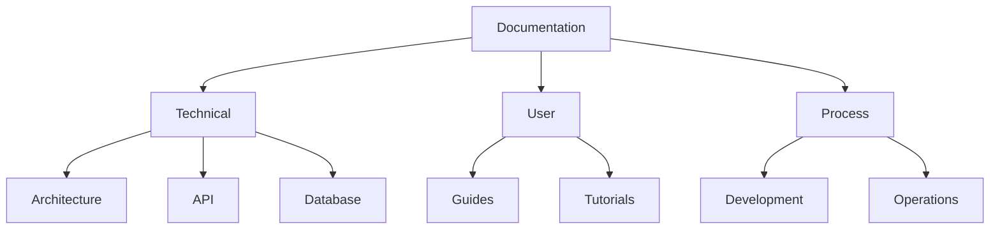
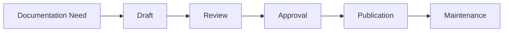

# Documentation Strategy

## Overview

The Documentation Strategy document defines our approach to creating, maintaining, and organizing documentation for the Mindscape platform. It covers documentation types, standards, tools, and processes to ensure comprehensive and accessible documentation.

## Documentation Structure

### Documentation Types
```yaml
documentation_types:
  technical:
    - architecture
    - api
    - database
    - infrastructure
  user:
    - getting started
    - user guides
    - tutorials
    - faq
  process:
    - development
    - deployment
    - maintenance
    - troubleshooting
```

### Documentation Organization


## Documentation Standards

### Style Guide
```yaml
style_guide:
  language:
    - clear and concise
    - active voice
    - present tense
    - consistent terminology
  formatting:
    - markdown
    - code blocks
    - diagrams
    - tables
  structure:
    - headings
    - lists
    - links
    - images
```

### Code Examples
```python
# Example code documentation
def calculate_mindmap_complexity(nodes: List[Node]) -> float:
    """
    Calculate the complexity of a mindmap based on its nodes.
    
    Args:
        nodes: List of nodes in the mindmap
        
    Returns:
        float: Complexity score between 0 and 1
    """
    return len(nodes) / 100.0
```

## Documentation Tools

### Documentation Platform
```yaml
documentation_platform:
  framework: docusaurus
  features:
    - versioning
    - search
    - dark mode
    - i18n
  integrations:
    - github
    - algolia
    - netlify
```

### Documentation Automation
```yaml
documentation_automation:
  api_docs:
    - openapi
    - swagger
    - postman
  code_docs:
    - sphinx
    - typedoc
    - jsdoc
  diagrams:
    - mermaid
    - plantuml
    - draw.io
```

## Documentation Process

### Creation Workflow


### Review Process
```yaml
review_process:
  criteria:
    - accuracy
    - completeness
    - clarity
    - consistency
  participants:
    - technical writers
    - developers
    - product owners
    - users
```

## Documentation Maintenance

### Version Control
```yaml
version_control:
  branches:
    - main: production
    - develop: staging
    - feature/*: new content
  workflow:
    - create branch
    - make changes
    - create pr
    - review
    - merge
```

### Updates
```yaml
update_process:
  triggers:
    - code changes
    - feature releases
    - bug fixes
    - user feedback
  frequency:
    - continuous
    - weekly
    - monthly
    - quarterly
```

## Technical Documentation

- [Development Guide](../technical/development/DEVELOPMENT_GUIDE)
- [API Documentation](../technical/api/API_DOCUMENTATION)
- [Database Schema](../technical/database/DATABASE_SCHEMA)
- [Infrastructure Overview](../technical/infrastructure/INFRASTRUCTURE_OVERVIEW)

## Related Documents

- [Core Strategy](CORE_STRATEGY)
- [Development and Agile Strategy](DEVELOPMENT_AND_AGILE_STRATEGY)
- [Quality Strategy](QUALITY_STRATEGY)
- [Security and Data Strategy](SECURITY_AND_DATA_STRATEGY)
