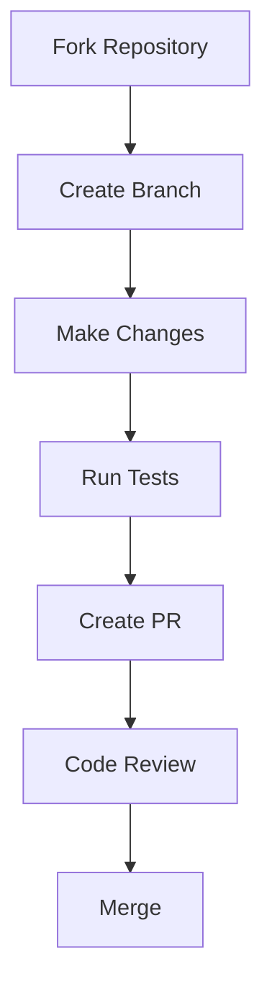
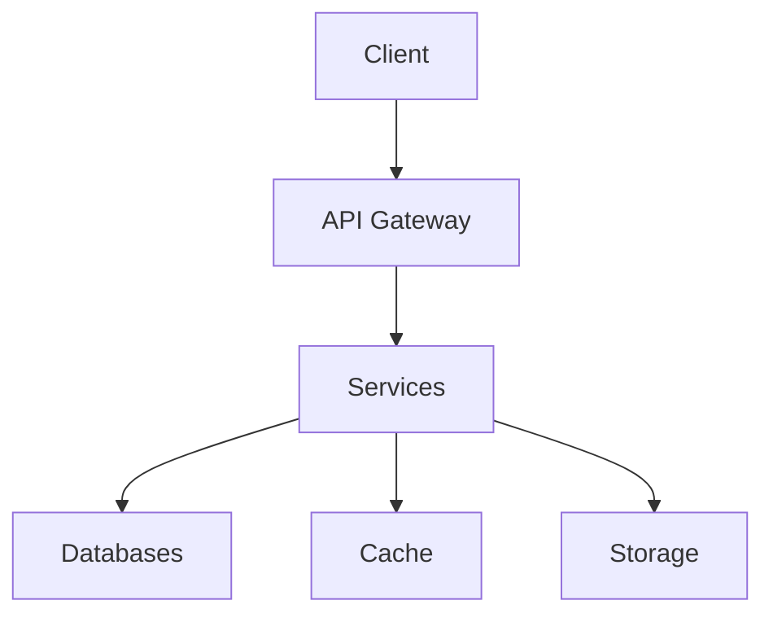

# Team and Process Strategy

## Overview

The Team and Process Strategy document outlines our approach to team management, onboarding, and contribution processes. It combines onboarding procedures, contribution guidelines, and sprint zero planning to ensure effective team collaboration and project setup.

## Onboarding Process

### New Team Member Onboarding
```yaml
onboarding_phases:
  pre_start:
    - welcome email
    - equipment setup
    - access requests
    - calendar invites
  first_week:
    - team introductions
    - project overview
    - development environment setup
    - initial training
  first_month:
    - mentorship program
    - code review participation
    - first contribution
    - feedback session
```

### Development Environment Setup
```bash
# Development environment setup script
#!/bin/bash

# Install dependencies
npm install
pip install -r requirements.txt

# Setup databases
docker-compose up -d postgres redis

# Run migrations
python manage.py migrate

# Start development server
npm run dev
```

## Contribution Guidelines

### Code Contribution Process


### Pull Request Template
```markdown
## Description
[Description of changes]

## Type of Change
- [ ] Bug fix
- [ ] New feature
- [ ] Breaking change
- [ ] Documentation update

## Testing
- [ ] Unit tests added/updated
- [ ] Integration tests added/updated
- [ ] Manual testing performed

## Documentation
- [ ] Code comments added/updated
- [ ] Documentation updated
```

## Sprint Zero Planning

### Project Setup
```yaml
sprint_zero_tasks:
  infrastructure:
    - repository setup
    - ci/cd pipeline
    - development environment
    - deployment configuration
  documentation:
    - architecture decisions
    - development guide
    - contribution guide
    - api documentation
  development:
    - project structure
    - coding standards
    - testing framework
    - dependency management
```

### Initial Architecture


## Team Collaboration

### Communication Channels
```yaml
communication:
  synchronous:
    - daily standup
    - sprint planning
    - sprint review
    - sprint retrospective
  asynchronous:
    - slack channels
    - github discussions
    - documentation
    - email
```

### Team Roles
```yaml
roles:
  technical_lead:
    - architecture decisions
    - code review
    - technical guidance
  product_owner:
    - requirements
    - prioritization
    - stakeholder communication
  developer:
    - implementation
    - testing
    - documentation
  qa_engineer:
    - testing
    - quality assurance
    - bug tracking
```

## Technical Documentation

- [Onboarding Strategy](ONBOARDING_STRATEGY)
- [Contribution Strategy](CONTRIBUTION_STRATEGY)
- [Sprint Zero Strategy](SPRINT_ZERO_STRATEGY)
- [Agile Strategy](AGILE_STRATEGY)

## Related Documents

- [Core Strategy](CORE_STRATEGY)
- [Development and Agile Strategy](DEVELOPMENT_AND_AGILE_STRATEGY)
- [Documentation Strategy](DOCUMENTATION_STRATEGY)
- [Quality Strategy](QUALITY_STRATEGY) 