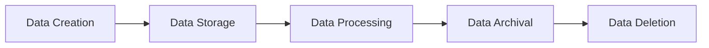

# Security and Data Strategy

## Overview

The Security and Data Strategy document defines our approach to data management, security, and privacy in the Mindscape platform. It combines data governance with security measures to ensure the protection and proper handling of all data assets.

## Security Principles

### Security Framework
```yaml
security_framework:
  principles:
    - zero trust
    - least privilege
    - defense in depth
    - secure by default
    - privacy by design
  standards:
    - ISO 27001
    - GDPR
    - SOC 2
    - OWASP Top 10
```

### Authentication and Authorization
```python
# Authentication configuration
AUTH_CONFIG = {
    'jwt': {
        'algorithm': 'RS256',
        'expiry': 3600,  # 1 hour
        'refresh_expiry': 604800  # 7 days
    },
    'oauth': {
        'providers': ['google', 'github'],
        'scopes': ['email', 'profile']
    }
}

# Role-based access control
ROLES = {
    'admin': ['*'],
    'editor': ['read', 'write', 'share'],
    'viewer': ['read']
}
```

## Data Management

### Data Classification
```yaml
data_classification:
  public:
    - mindmap metadata
    - public profiles
    - shared content
  internal:
    - user preferences
    - system logs
    - analytics
  confidential:
    - user credentials
    - personal data
    - payment information
```

### Data Lifecycle


## Security Measures

### Infrastructure Security
```yaml
infrastructure_security:
  network:
    - vpc isolation
    - security groups
    - web application firewall
    - ddos protection
  encryption:
    - tls 1.3
    - at-rest encryption
    - key management
    - secrets management
```

### Application Security
```python
# Security middleware
@app.middleware("http")
async def security_headers(request: Request, call_next):
    response = await call_next(request)
    response.headers["X-Content-Type-Options"] = "nosniff"
    response.headers["X-Frame-Options"] = "DENY"
    response.headers["X-XSS-Protection"] = "1; mode=block"
    response.headers["Content-Security-Policy"] = "default-src 'self'"
    return response
```

## Data Governance

### Data Models
```python
# User data model
class User(BaseModel):
    id: UUID
    email: EmailStr
    password_hash: str
    role: UserRole
    created_at: datetime
    last_login: datetime
    preferences: Dict[str, Any]
```

### Data Operations
```python
# Data access patterns
async def get_user_data(user_id: UUID) -> UserData:
    async with db.transaction():
        user = await db.get_user(user_id)
        if not user:
            raise NotFoundError("User not found")
        return await process_user_data(user)
```

## Compliance and Privacy

### Privacy Controls
```yaml
privacy_controls:
  data_minimization:
    - collect only necessary data
    - regular data cleanup
    - anonymization where possible
  user_controls:
    - data export
    - data deletion
    - consent management
    - privacy settings
```

### Compliance Framework
```yaml
compliance:
  gdpr:
    - data protection officer
    - privacy impact assessments
    - data processing agreements
    - breach notification
  security:
    - regular audits
    - penetration testing
    - vulnerability scanning
    - incident response
```

## Technical Documentation

- [Security Strategy](SECURITY_STRATEGY)
- [Data Strategy](DATA_STRATEGY)
- [Infrastructure Overview](../technical/infrastructure/INFRASTRUCTURE_OVERVIEW)
- [Database Schema](../technical/database/DATABASE_SCHEMA)

## Related Documents

- [Core Strategy](CORE_STRATEGY)
- [Infrastructure Strategy](INFRASTRUCTURE_STRATEGY)
- [Quality Strategy](QUALITY_STRATEGY)
- [Documentation Strategy](DOCUMENTATION_STRATEGY) 