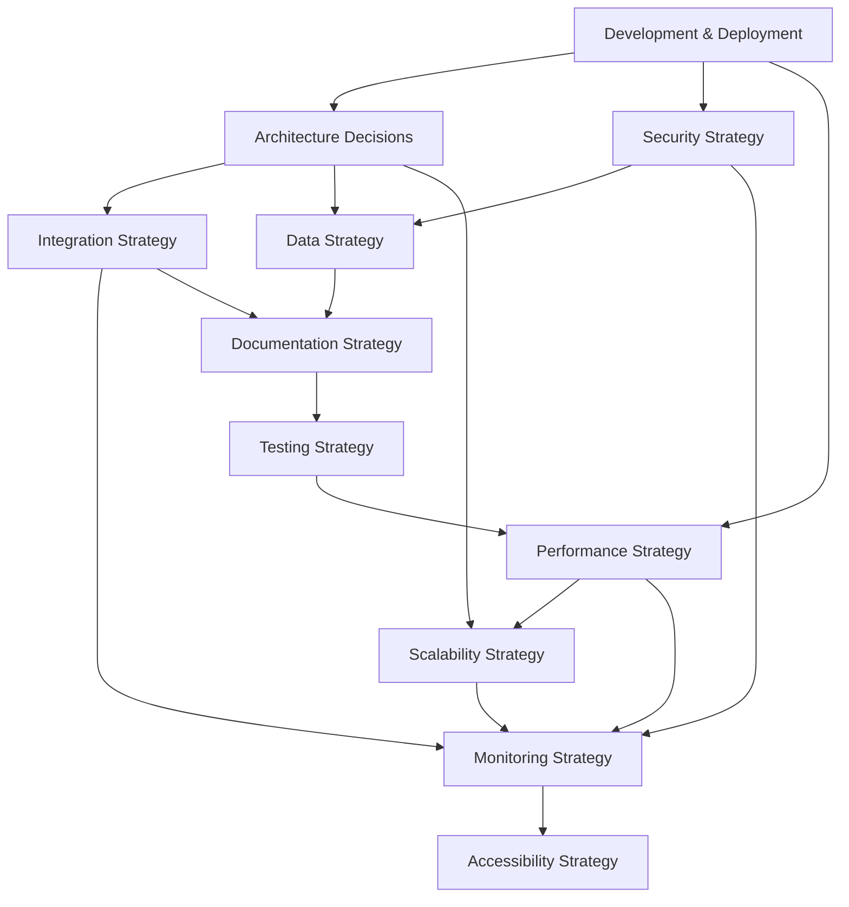
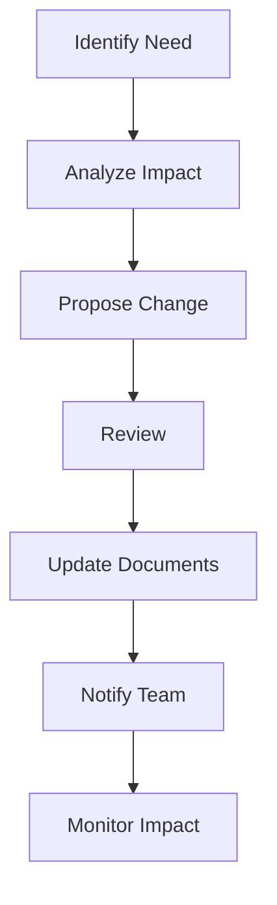

# Mindscape Strategy Documentation

This directory contains the strategic documentation for the Mindscape project. For a complete overview of our strategy documentation, please refer to the [Meta Strategy](./META_STRATEGY) document.

## Quick Links

### Core Documents
- [Meta Strategy](./META_STRATEGY) - Overview and governance of all strategy documents
- [Development Strategy](./DEVELOPMENT_STRATEGY) - Development workflow and deployment processes
- [Architecture Decisions](./ARCHITECTURE_DECISIONS) - Key architectural decisions and patterns

### Quality & Security
- [Testing Strategy](./TESTING_STRATEGY) - Testing approach and requirements
- [Security Strategy](./SECURITY_STRATEGY) - Security principles and practices
- [Performance Strategy](./PERFORMANCE_STRATEGY) - Performance goals and optimization

### Data & Integration
- [Data Strategy](./DATA_STRATEGY) - Data management and governance
- [Integration Strategy](./INTEGRATION_STRATEGY) - API design and service integration
- [Monitoring Strategy](./MONITORING_STRATEGY) - Observability and alerting

### User Experience & Documentation
- [Accessibility Strategy](./ACCESSIBILITY_STRATEGY) - Accessibility standards and practices
- [Documentation Strategy](./DOCUMENTATION_STRATEGY) - Documentation requirements and standards

### Infrastructure & Scaling
- [Scalability Strategy](./SCALABILITY_STRATEGY) - Scaling patterns and practices

## Getting Started

1. Read the [Meta Strategy](./META_STRATEGY) for a complete understanding of our strategy documentation
2. Follow the role-based document recommendations in the meta strategy
3. Use the document relationships diagram to understand dependencies
4. Follow the contribution guidelines when making changes

## Need Help?

Refer to the Support Channels section in the [Meta Strategy](./META_STRATEGY) document for assistance.



## Document Maintenance

### Review Schedule
- Critical documents: Quarterly review
- Supporting documents: Bi-annual review
- Full documentation audit: Annual

### Version Control
- All changes through pull requests
- Minimum two reviewers
- Change log maintenance
- Version tagging for major updates

### Enforcement
- Pre-commit hooks for documentation standards
- CI/CD checks for documentation updates
- PR templates with documentation checklist
- Regular compliance audits

## Strategy Evolution

### Change Process


### Impact Analysis
Before making changes:
1. Identify affected documents
2. Assess downstream impact
3. Consider implementation effort
4. Plan transition period
5. Prepare communication

## Compliance and Auditing

### Strategy Compliance
- Regular audits
- Automated checks
- PR reviews
- Team training
- Feedback loops

### Documentation Health
```markdown
## Health Metrics
- Document freshness
- Reference accuracy
- Implementation alignment
- Team understanding
- Feedback incorporation
```

## Support and Resources

### Tools and Templates
- PR templates
- Document templates
- Validation scripts
- Review checklists
- Impact analysis tools

### Contact Information
- Strategy owners
- Document maintainers
- Subject matter experts
- Review team
- Support channels 
