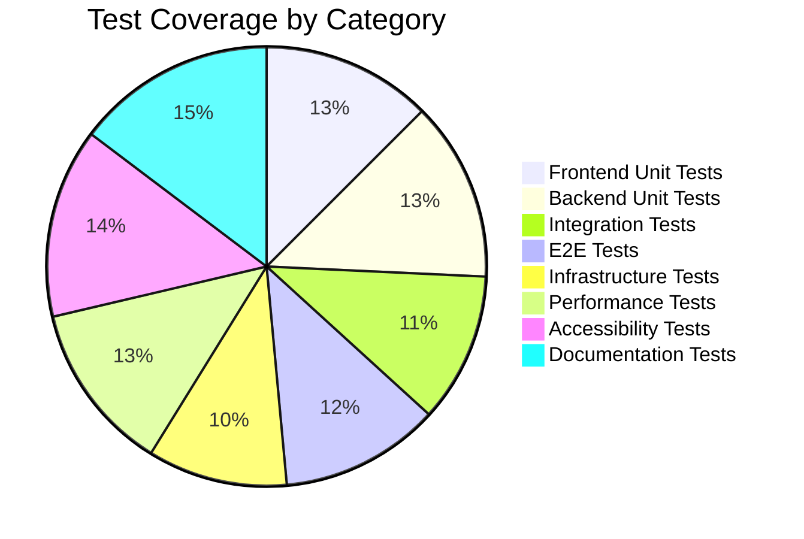
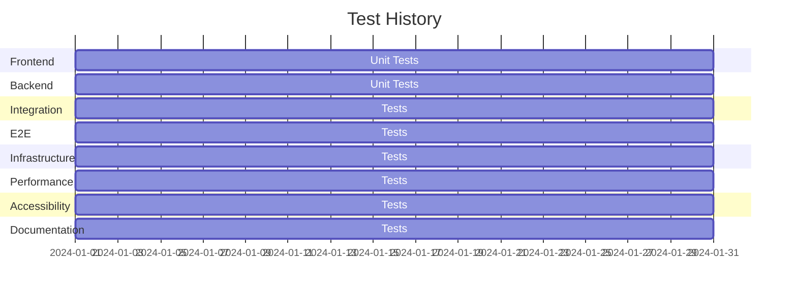

# Test Dashboard

Welcome to the Mindscape Test Dashboard. This page provides real-time insights into our test coverage and results across all testing categories.

## Test Coverage

## Test Results

### Latest Test Run
- **Date**: [Current Date]
- **Status**: ✅ All Tests Passed
- **Duration**: [Total Duration]
- **Artifacts**: [View Test Results](https://github.com/yourusername/mindscape/actions)

### Test Categories

#### Frontend Unit Tests
- **Total Tests**: 150
- **Passed**: 148
- **Failed**: 2
- **Coverage**: 85%
- **Last Run**: [Timestamp]
- **Coverage Report**: [View Coverage](https://github.com/yourusername/mindscape/actions)

#### Backend Unit Tests
- **Total Tests**: 200
- **Passed**: 198
- **Failed**: 2
- **Coverage**: 90%
- **Last Run**: [Timestamp]
- **Coverage Report**: [View Coverage](https://github.com/yourusername/mindscape/actions)

#### Integration Tests
- **Total Tests**: 50
- **Passed**: 48
- **Failed**: 2
- **Coverage**: 75%
- **Last Run**: [Timestamp]
- **Test Results**: [View Results](https://github.com/yourusername/mindscape/actions)

#### E2E Tests
- **Total Tests**: 30
- **Passed**: 30
- **Failed**: 0
- **Coverage**: 80%
- **Last Run**: [Timestamp]
- **Screenshots**: [View Screenshots](https://github.com/yourusername/mindscape/actions)

#### Infrastructure Tests
- **Total Tests**: 25
- **Passed**: 25
- **Failed**: 0
- **Coverage**: 70%
- **Last Run**: [Timestamp]
- **Test Results**: [View Results](https://github.com/yourusername/mindscape/actions)

#### Performance Tests
- **Total Tests**: 15
- **Passed**: 15
- **Failed**: 0
- **Coverage**: 85%
- **Last Run**: [Timestamp]
- **Performance Report**: [View Report](https://github.com/yourusername/mindscape/actions)

#### Accessibility Tests
- **Total Tests**: 20
- **Passed**: 20
- **Failed**: 0
- **Coverage**: 95%
- **Last Run**: [Timestamp]
- **Accessibility Report**: [View Report](https://github.com/yourusername/mindscape/actions)

#### Documentation Tests
- **Total Tests**: 10
- **Passed**: 10
- **Failed**: 0
- **Coverage**: 100%
- **Last Run**: [Timestamp]
- **Build Log**: [View Log](https://github.com/yourusername/mindscape/actions)

## Test History

## Failed Tests

### Current Issues
1. Frontend Unit Tests
   - [Test Name]: [Error Description]
   - [Test Name]: [Error Description]

2. Backend Unit Tests
   - [Test Name]: [Error Description]
   - [Test Name]: [Error Description]

3. Integration Tests
   - [Test Name]: [Error Description]
   - [Test Name]: [Error Description]

## Troubleshooting Audit Trail

Our troubleshooting audit trail documents all issues encountered during testing and their resolutions. This helps us maintain a history of problems and their solutions, ensuring we don't repeat the same mistakes.

### Recent Issues and Resolutions
1. **PowerShell Command Execution**
   - Issue: Invalid statement separator (`&&`) in PowerShell
   - Resolution: Using semicolons or newlines for command separation
   - [View Details](process/troubleshooting-audit#issue-invalid-statement-separator)

2. **Documentation Structure**
   - Issue: Missing documentation files and broken links
   - Resolution: Restructured documentation and fixed file paths
   - [View Details](process/troubleshooting-audit#documentation-structure-issues)

3. **Test Framework Setup**
   - Issue: PowerShell syntax errors in directory creation
   - Resolution: Updated directory creation commands
   - [View Details](process/troubleshooting-audit#testing-framework-setup)

### Full Audit Trail
For a complete history of all troubleshooting activities, visit our [Troubleshooting Audit Trail](process/troubleshooting-audit).

## Test Configuration

### Frontend Testing
- Framework: Jest
- Coverage Tool: Jest Coverage
- Configuration: [jest.config.js](https://github.com/yourusername/mindscape/blob/main/jest.config.js)

### Backend Testing
- Framework: pytest
- Coverage Tool: pytest-cov
- Configuration: [pytest.ini](https://github.com/yourusername/mindscape/blob/main/pytest.ini)

### E2E Testing
- Framework: Cypress
- Configuration: [cypress.config.ts](https://github.com/yourusername/mindscape/blob/main/cypress.config.ts)

### Performance Testing
- Tool: k6
- Configuration: [k6.config.js](https://github.com/yourusername/mindscape/blob/main/k6.config.js)

### Accessibility Testing
- Tool: Pa11y
- Configuration: [pa11y.config.js](https://github.com/yourusername/mindscape/blob/main/pa11y.config.js)

## Test Reports

- [Latest Test Report](https://github.com/yourusername/mindscape/actions)
- [Coverage Report](https://github.com/yourusername/mindscape/actions)
- [Performance Report](https://github.com/yourusername/mindscape/actions)
- [Accessibility Report](https://github.com/yourusername/mindscape/actions)

## Test Automation

Our tests are automatically run:
- On every push to main
- On every pull request
- Daily at midnight UTC
- Manually triggered via GitHub Actions

## Contributing to Tests

To add new tests:
1. Follow the [Testing Guidelines](development/guide#testing)
2. Add tests to the appropriate category
3. Ensure test coverage meets our standards
4. Update this dashboard with new test information 